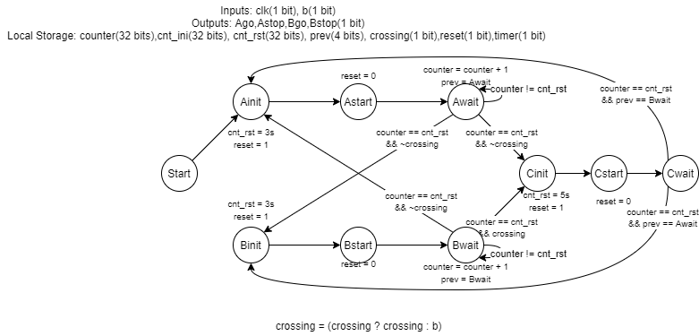
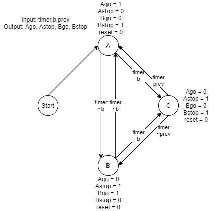

# TrafficSignal  
Steven Calvert  
Nicholas Cardinal  

Traffic Signal RTL design including crosswalk input.

## Detailed Specification

The purpose of this project is to serve as a functioning traffic signal that allows each street 3 seconds of time to go, along with a crossing signal that can be activated after any transition between lights. The project accomplishes this through RTL design and an HLSM, with the use of a timer that the comparison value can be changed in.  

One primary design constraint we encountered was that the timer used in Lab 6 could not be used in this project, due to it not functioning within the simulation which was required for the project. To remedy this, we constructed our own timer in which the value it counts to could be modified, allowing for more modularity in the design. Overall, we only needed two verilog modules, one to hold our primary design and FSM, and the other to hold our timer, which in itself contained adders, comparators, and other datapath items that were used. Since the street lights were on a 3 second timer, and the crosswalk was on a 5 second timer, the beginning of each sequence of the FSM would ensure that the proper value was loaded into the timer, that is, changing the hex value that the internal value would count to. The timer would count up on every clock edge, using internal registers to keep track of its internal timing. To eliminate race conditions, the reset was reset on the initial state of every sequence, which would lead into a start, then a wait state that would wait until the timer had completed its counting.

## System Design, Architecture, and Performance.
### HLSM
  
The HLSM of our design ensures that there are no race conditions between inputs externally and the inputs coming from the datapath. The extended states permit each signal time to reset the current value in the datapath, to make sure the value in the datapath is completely reset before it reaching the waiting state, that iterates until the counter has reached the terminal value.

### Datapath
  
The datapath is comprised of an adder and a comparator, as well as three registers to hold internal values, one to hold the initial value, another to hold the terminal value, and another to hold the current value of the counter. At each clock pulse while the reset is 0, the internal counter will be incremented by 1 with the adder, then compared against the terminal value to test if the output timer should be 1.

### FSM
  
The FSM closely follows our HLSM, but only with 3 (6 actually) states based on the external inputs and the inputs from the datapath. The reset is 0 at all states, to enable counting, and the reset is 1 between state transitions.(With technical init states that reset the value in the datapath.)

### Verilog Code
See attached documents for all verilog code.

### Simulation
  
In this waveform, b is pressed early on in the cycle for A, and transitions to the C state once the three seconds for A are up. After 5 seconds with both streetlights red, the cycle continues to state B where Bgo is on, and Astop is on. The cycle between A and B continues unless the button is pressed, or the circuit is powered off.

## Difficulties and issues

## Conclusions
