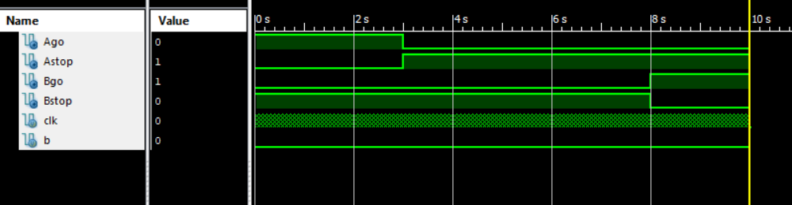

# TrafficSignal  
Steven Calvert  
Nicholas Cardinal  

Traffic Signal RTL design including crosswalk input.

## Detailed Specification

The purpose of this project is to serve as a functioning traffic signal that allows each street 3 seconds of time to go, along with a crossing signal that can be activated after any transition between lights. The project accomplishes this through RTL design and an HLSM, with the use of a timer that the comparison value can be changed in.  

One primary design constraint we encountered was that the timer used in Lab 6 could not be used in this project, due to it not functioning within the simulation which was required for the project. To remedy this, we constructed our own timer in which the value it counts to could be modified, allowing for more modularity in the design. Overall, we only needed two verilog modules, one to hold our primary design and FSM, and the other to hold our timer, which in itself contained adders, comparators, and other datapath items that were used. Since the street lights were on a 3 second timer, and the crosswalk was on a 5 second timer, the beginning of each sequence of the FSM would ensure that the proper value was loaded into the timer, that is, changing the hex value that the internal value would count to. The timer would count up on every clock edge, using internal registers to keep track of its internal timing. To eliminate race conditions, the reset was reset on the initial state of every sequence, which would lead into a start, then a wait state that would wait until the timer had completed its counting.

## System Design, Architecture, and Performance.
### HLSM

## Difficulties and issues

## Conclusions
